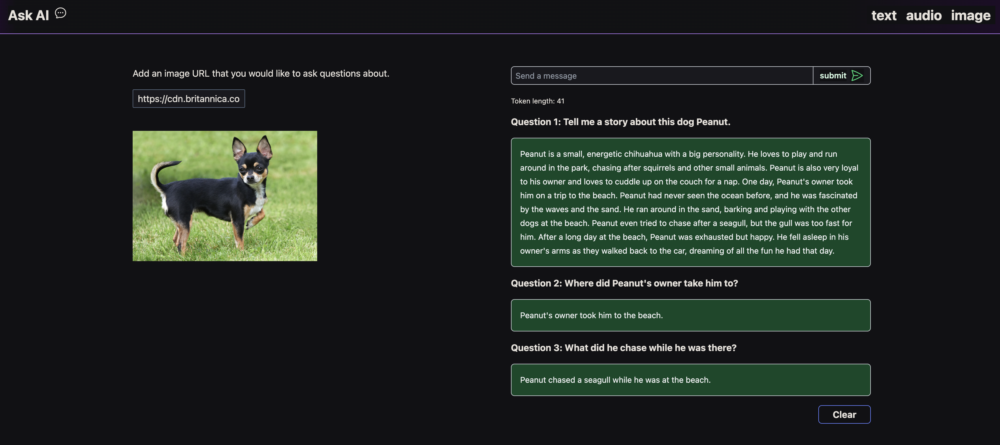

# AI-Powered-App



This is a project that demonstrates how to use several AI technologies:

- OpenAI chat completion API
- Deepgram speech-to-text API
- Replicate API to run the miniGPT vision encoder model
- gpt-3-encoder package to tokenize strings into tokens (which are used to set limits on the length of prompts sent to OpenAI)
- Langchain model, chain, and memory interfaces

## Get it Working

To see this project working, you can clone the project and then do the following.

### Install dependencies

```
npm install
```

### Create .env file

Create a `.env` file at the root of the project and then go into the `.gitignore` file and add `.env` to the list. This will make sure that the `.env` file does not get pushed up to github if you choose to push the project up to github.

## API Keys

Add API keys to the `.env` file as you see in the `.env-example` file. Go to each of these websites to sign up for an API key:

[OpenAI](https://platform.openai.com/signup)

[Deepgram](https://dpgr.am/deepgram-signup)

[Replicate](https://replicate.com/)

### Run the web server and the node server

```
npm run start
```

### To see the Langchain features, switch to the `langchain` branch

```
git checkout langchain
```

### To see the starter code before the features have been added, switch to the `starting-code` branch

```
git checkout starting-code
```

### To see starting code and ending code for each chapter, switch to the chapter number + "start" or "end"

```
git checkout 03-start
git checkout 03-end
```

### Questions

If you have any questions, you can reach out to me on [twitter](https://twitter.com/sandra_rodgers_)

## December 2024 Updates

Updates were made in December 2024 due to breaking changes to the OpenAI, Deepgram, and Replicate APIs. These are explanations of the changes that were made.

## Open AI updates

Code was updated to use the new way of creating the openai client. You can see a diff at https://github.com/SandraRodgers/Ask-AI/commit/9cce3610593391d45739966072224b812f1d2232.

These updates were made to branches `main`, `langchain`, `03-end`, `04-start`, `04-end`, `05-start`, `05-end`, `06-start`, `06-end`, `07-start`, `07-end`, `08-start`, `08-end`, `09-start`, `09-end` (so all branches except for `03-start`)

Lesson 3 in the video course will need to be updated to present this new way of creating the openai client.There is also one example in lesson two that presents a snippet of the code (see the section "Request Prompt Format")

### Code changes

1. Updated to version `^4.71.1`
2. Updated openai config in `server.js`:

```js
////// OpenAI config //////
const { OpenAI } = require('openai')

const client = new OpenAI({
  apiKey: process.env.OPENAI_API_KEY
})

// OpenAI chat completion
app.post('/chat', async (req, res) => {
  const messages = req.body.messages
  console.log(messages)
  try {
    if (messages == null) {
      throw new Error('We have a problem - no prompt was provided')
    }

    const response = await client.chat.completions.create({
      model: 'gpt-3.5-turbo',
      messages
    })
    const completion = response.choices[0].message
    console.dir(response.choices[0], { depth: 4 })
    return res.status(200).json({
      success: true,
      message: completion
    })
  } catch (error) {
    console.log(error.message)
  }
})
```

## Deepgram updates

Code was updated to use the new way of creating the deepgram client. You can see a diff at https://github.com/SandraRodgers/Ask-AI/commit/e2df40f043662ff44747f8d938f41b540ee1d52b

These updates were made to branches `main`, `langchain`,`05-end`, `06-start`, `06-end`, `07-start`, `07-end`, `08-start`, `08-end`, `09-start`, `09-end` (so all branches except for `03-start`, `04-start`, `04-end`)

Lesson 5 in the video course will need to be updated to present this new way of creating the deepgram client.

### Code changes

1. Updated to version `^3.9.0`
2. Updated deepgram config in `server.js`:

```js
////// Deepgram config //////
const { createClient } = require('@deepgram/sdk')
const deepgram = createClient(process.env.DG_API)

// Deepgram transcription
app.post('/dg-transcription', upload.single('file'), async (req, res) => {
  try {
    console.log(req.file)
    if (!req.file) {
      return res.status(400).send('No file uploaded')
    }

    const audioBuffer = req.file.buffer

    const response = await deepgram.listen.prerecorded.transcribeFile(audioBuffer, {
      punctuate: true,
      model: 'nova-2'
    })

    console.dir(response, { depth: 4 })

    res.send({ transcript: response.result })
  } catch (e) {
    console.error('Error:', e)
    res.status(500).send('An error occurred during transcription')
  }
})
```

## Langchain updates

Code was updated to use the new way of creating the langchain-openai client (just two lines of code). You can see a diff at https://github.com/SandraRodgers/Ask-AI/commit/55b2c88ae3701647ca224376bc11bdbca41ff381

These updates were made to branches `langchain`, `07-end`, `08-start`, `08-end`, `09-start`, `09-end`

Lesson 7 in the video course will need to be updated to present this new way of creating the langchain-openai client. However, it's a very small change.

The change adds `const { OpenAI: OpenAIClient } = require('@langchain/openai')`, and the reason that we add the `: OpenAIClient` is so that we can use a different name from the openai client used higher up in the same file. Thus when we instantiate the model, we can do: `const model = new OpenAIClient({}) `

### Code changes

1. Updated to version `^0.0.299`
2. Updated `server.js`

```js
////// LangChain Config //////
const { OpenAI: OpenAIClient } = require('@langchain/openai')
const { BufferMemory } = require('langchain/memory')
const { ConversationChain } = require('langchain/chains')

// Specify the model here
const model = new OpenAIClient({})
const memory = new BufferMemory()
const chain = new ConversationChain({ llm: model, memory: memory })
let chainNum = 0
```

## Replicate updates

Code was updated because the model id for minigpt-4 had changed. See a diff at: https://github.com/SandraRodgers/Ask-AI/commit/0775a8537d046475877c8b85b8d9c1e34ab2633d

These updates were made to branches `main`, `08-end`, `09-start`, `09-end`.

Lesson 8 and 9 in the video course (server.js section) will need to be updated with the new model id.

### Code changes

1. Update `server.js`

```js
const miniGPT =
  'daanelson/minigpt-4:e447a8583cffd86ce3b93f9c2cd24f2eae603d99ace6afa94b33a08e94a3cd06'
```
